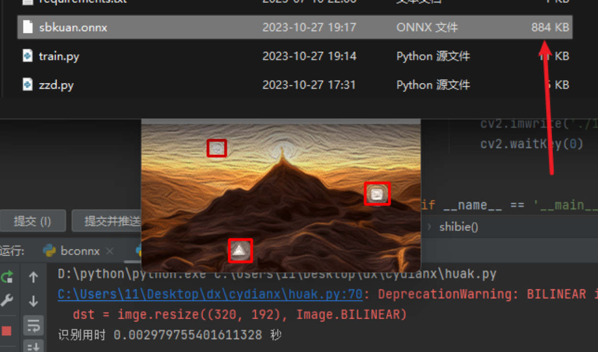

数据集格式
```text

类别   框中心点的x比例   框中心点的y比例        框的宽的x比例          框的高的y比例
4   0.1015625        0.24722222222222223 0.19062500000000002 0.35000000000000003
4 0.34375 0.3944444444444445 0.19375 0.2777777777777778
4 0.2078125 0.7833333333333333 0.171875 0.3666666666666667
6 0.5265625 0.7722222222222223 0.203125 0.35555555555555557
3 0.6375000000000001 0.35833333333333334 0.16875 0.38333333333333336
48 0.7828125 0.8166666666666667 0.146875 0.34444444444444444

```


train.py 可以自己配置的参数
```python
# 图片划分为5x3去识别
needJj = [5,3] # 需要识别的图标越小 这里就调节越大 例如 needJj = [6,4]
# 图片压缩为的大小
tpxz = ( 192,320) # 需要注意防止失真
```


可切换分类模型 (zzd.py 或者 huak.py中)
```python
    def shibie(self,imgpa):
        tp, imge = self.getimage(imgpa)
        d = time.time()
        kuane = self.mymodo.run(None, {self.mymodo.get_inputs()[0].name: tp})
        kuan = self.hetInfo(kuane) # 获得框的信息 去剪切物体
        # 下面可以不要了 然后换你的模型去识别物体

```

运行 train.py

运行 flmox.py

运行 bconnx.py 把pth转onnx


测试 运行zzd.py 画框并分类

测试 运行huak.py 只画框 然后自己可以结合框的信息去裁剪出框，然后分类框里面是什么


视频教程地址:https://www.bilibili.com/video/BV1o84y197c8/?vd_source=93dc7417d09246b7259569c65e2eb085


需要226算法并发或者其他模型可以联系这位大佬wx:z596918978


下面是只画框（huak.py ）
 